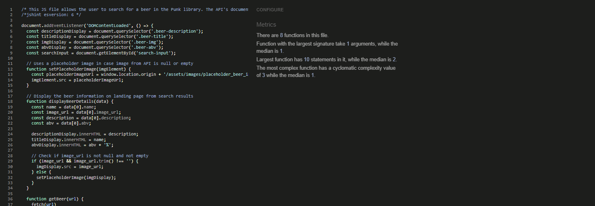
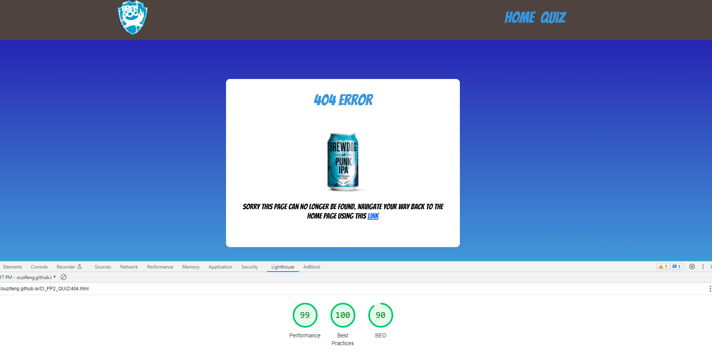

# Brewdog

### Use Case

Brewdog is one of the largest craft beer manufacturers in the UK. Their marketing department has been given the task to increase their email userbase, in order to improve the revenue stream atttributed to email marketing. The marketing department has approached me to build an interactive website with a quiz so that the marketing department can capture email addresses of potential customers. A nice to have would also be a searchable library of all the beers Brewdog sells.

[Live Site](https://ouzifeng.github.io/CI_PP2_QUIZ/)

## Table of Content

1. [Project Scope](#project-scope)
    1. [End User Requirements](#end-user-requirements)
    2. [Customer Goals](#project-scope)

2.  [User Experience](#user-experience)
    1. [Target Audience](#target-audience)
    2. [UX IU](#ux-ui)

3. [User Stories](#user-stories)
    1. [New to the brand Brewdog](#new-to-the-brand-brewdog)
    2. [First Time Players](#first-time-players)
    3. [Returning Players](#returning-players)
    4. [Site Owner](#site-owner)

4. [Design](#design)
    1. [Fonts](#fonts)
    2. [Colour Scheme](#colour-scheme)
    3. [Wireframes](#wireframes)

5. [Technologies & Resources Used](#technologes-&-resources-used)

6. [Testing](#testing)
    1. [HTML validation](#html-validation)
    2. [CSS validation](#css-validation)
    3. [Javascript Validation](#javascript-validation)
    3. [Accessbility](#accessibility)
    4. [Broken Links](#broken-links)
    5. [Performance](#performance)
    6. [Performance test on different devices](#performance-test-on-different-devices)
    7. [Browser compatibility](#browser-compatibility)
    8. [Testing User Stories](#testing-user-stories)

7. [Features](#features)
    1. [Structure](#structure)
    2. [Random Beer Button](#random-beer-button)
    3. [Search Beer Function](#search-beer-function)
    4. [Quiz Rules](#quiz-rules)
    5. [Running Score and Progress Bar](#running-score-and-progress-bar)
    6. [Display correct answer](#display=correct-answer)
    7. [Feedback form](#feedback-form)
    8. [Play Again Button](#play-again-button)
    9. [Form Validation](#form-validation)
    10. [Feedback](#feedback)

8. [Bugs](#bugs)

9. [Deployment](#deployment)

10. [Credits](#credits)

11. [Acknowledgements](#acknowledgements)

## Project Scope

The scope of this project is to create a challenging quiz for craft beer enthusiasts to capture email addresses, and to build an interactive library of Brewdog beers for users to learn more about the wide range of beers Brewdog manufacturers.

### End User Requirements

* Learn more about Brewdog's beers
* Test mny craft beer knowledge

### Customer Goals

* Make website interative
* Website must be responsive and accessible
* All customer inputs must be validated for errors, with clear feedback where inputs are incorrect
* Show off their range of beers in a fun way
* Capture user email address
* Include a fun quiz for users

## User Experience

### Target Audience

* Anyone interested in craft beer
* Those who want to know more about Brewdog's range of beers

### UX UI

* Responsive design across mobile, tablet and desktop/laptops
* Easy to navigate to and find the quiz
* Easy to understand the game rules
* No dead links
* Links to Brewdog's Facebook and Instagram pages
* Way to give feedback about the quiz
* Replay the quiz if I want

## User Stories

### New to the brand Brewdog

1. I want to know more about the range of beers brewdog sells
2. I want to know the strength of the beers brewdog sells

### First time players

3. I want to be able to understand the rules of the quiz
4. I want to know my running score
5. I want to know how many questions I have left
6. I want to be able to get in touch with developer to leave feedback
7. I want to game to be responsive no matter what device is played on.
8. I want to have my results emailed to me so I can show off to my friends
9. I want to know feedback has been sent

### Returning Players

10. I want to be able to restart the quiz

### Site Owner

11. I want the user to easy understand the rules of the quiz
12. I want a 404 page with a redirect to the homepage
13. I want the user to see the correct answer if they selected the wrong one
14. I want to be able to collect the users email address
15. I want to make sure users are inputing a valid email

## Design

### Fonts

For the font choice we needed something which looked vibrant and welcoming
* Bangers for headings
* Nunito for the body text

### Colour Scheme

Based on how the othercraft brewer's websites look I went for a vibrant and colourful scheme:
 * https://beavertownbrewery.co.uk/
 * https://coldtownbeer.com/
 * https://twotribes.co.uk/

### Wireframes

Home

Quiz

404

## Technologies & Resources Used

Languages

* Javascript
* HTML
* CSS

#### Frameworks, Libraries & Tools

* Balsamiq for wireframe designs 
* Google Fonts for fonts
* Photoshop
* Canva
* Coolors
* Bootsrap V5
* Microsoft Bing Image Generator (logo)
* Compressor.io to losslessy reduce image size
* Favicon.io
* Am I Responsive
* Font Awesome
* Git and Github
* WC3 Validator, Jigsaw W3 Validator, JShint, Wave Validator, Lighthouse

## Testing

### HTML validation

Tool for HTML Validation - W3C HTML Validation Service

index.html [results](https://validator.w3.org/nu/?doc=https%3A%2F%2Fouzifeng.github.io%2FCI_PP2_QUIZ)

404.html [results](https://validator.w3.org/nu/?doc=https%3A%2F%2Fouzifeng.github.io%2FCI_PP2_QUIZ%2F404.html)

quiz.html [results](https://validator.w3.org/nu/?doc=https%3A%2F%2Fouzifeng.github.io%2FCI_PP2_QUIZ%2Fquiz.html)

No errors or warnings

### CSS Validation

Tool for CSS Validation - W3C CSS Validation Service

Full site validation: [results](https://jigsaw.w3.org/css-validator/validator?uri=https%3A%2F%2Fouzifeng.github.io%2FCI_PP2_QUIZ%2Fassets%2Fcss%2Fstyle.css&profile=css3svg&usermedium=all&warning=1&vextwarning=&lang=en)

No errors or warnings

### Javascript Validation

All Javascript files tested, no errors.

email.js

main.js

quiz.js

randomBeer.js

searchBeer.js

### Accessibility

The WAVE WebAIM web accessibility evaluation tool was used to ensure the website met the neccessary accessibility standards.

index.html [results](https://wave.webaim.org/report#/https://ouzifeng.github.io/CI_PP2_QUIZ/)

Zero errors

404.html [results](https://wave.webaim.org/report#/https://ouzifeng.github.io/CI_PP2_QUIZ/404.html)

Zero errors

quiz.html [results](https://wave.webaim.org/report#/https://ouzifeng.github.io/CI_PP2_QUIZ/quiz.html)

Zero errors

### Broken Links

Website checked using https://www.deadlinkchecker.com/, no broken links found

Broken Links

### Performance

Google Lighthouse was used to measure performance of each page.

All pages scored 100 on best practices and 99-100 on performance.

Home

404

Quiz

### Performance test on different devices
The website was tested on the following screen sizes and devices:
- Windows desktop 28inch and 22inch screens
- Macbook pro
- Huawei 8" tablet
- Apple iPhone 13
- Google Pixel 7
- Surface Duo

### Browser compatibility
The website was tested onthe following browsers:
- Chrome
- Safari
- Firefox

### Testing User Stories

#### New to the brand Brewdog

1. I want to know more about the range of beers brewdog sells

| **Feature** | **Action** | **Expected Result** | **Actual Result** |
|-------------|------------|---------------------|-------------------|
| Random Beer | Random Brewdog beer appears on homepage | Beer with name, image and information loads | Works as expected |
| Search beer | Search for a beer on homepage | Input "alpha" to find Alpha Dog beer | Works as expected

Random & Search Beer

2. I want to know the strength of the beers brewdog sells

| **Feature** | **Action** | **Expected Result** | **Actual Result** |
|-------------|------------|---------------------|-------------------|
| Display ABV on beer info | Load a random beer | Beer loads with ABV highlighted | Works as expected |

ABV

#### First time players

3. I want to be able to understand the rules of the quiz

| **Feature** | **Action** | **Expected Result** | **Actual Result** |
|-------------|------------|---------------------|-------------------|
| Quiz rules | Visit quiz page | Quiz rules are displayed | Works as expected |

Quiz Rules

4. I want to know my running score

| **Feature** | **Action** | **Expected Result** | **Actual Result** |
|-------------|------------|---------------------|-------------------|
| Running score | Start quiz | Score is displayed in bottom left hand corner of quiz | Works as expected |

Running Score

5. I want to know how many questions I have left

| **Feature** | **Action** | **Expected Result** | **Actual Result** |
|-------------|------------|---------------------|-------------------|
| Progress bar on quiz page | Start quiz | Progress bar moves as questions are answered | Works as expected |

Progress Bar

6. I want to be able to get in touch with developer to leave feedback

 **Feature** | **Action** | **Expected Result** | **Actual Result** |
|-------------|------------|---------------------|-------------------|
| Feedback form | Finish quiz | Option to leave feedback | Works as expected |

Quiz Feedback

7. I want to game to be responsive no matter what device is played on.

| **Feature** | **Action** | **Expected Result** | **Actual Result** |
|-------------|------------|---------------------|-------------------|
| Site built to be responsive on all devices | Visit quiz on desktop/laptop/tablet/mobile | Quiz visibile on all devices | Works as expected |

Responsive Quiz

8. I want to have my results emailed to me so I can show off to my friends

| **Feature** | **Action** | **Expected Result** | **Actual Result** |
|-------------|------------|---------------------|-------------------|
| Submit email form | Finish quiz and input email | Results are emailed to user | Works as expected |

Email Results

9. I want to know feedback has been sent

| **Feature** | **Action** | **Expected Result** | **Actual Result** |
|-------------|------------|---------------------|-------------------|
| Notice saying feedback sent | Submit feedback | NOtification says feedback has been sent to developer | Works as expected |

Feedback Sent

#### Returning Players

10. I want to be able to restart the quiz

| **Feature** | **Action** | **Expected Result** | **Actual Result** |
|-------------|------------|---------------------|-------------------|
| Play again button | Finish quiz | Button to replay appears | Works as expected |

Restart Quiz

#### Site Owner

11. I want the user to easy understand the rules of the quiz

| **Feature** | **Action** | **Expected Result** | **Actual Result** |
|-------------|------------|---------------------|-------------------|
| Quiz rules | Visit quiz page | Quiz rules are displayed | Works as expected |

Quiz Rules

12. I want a 404 page with a redirect to the homepage

| **Feature** | **Action** | **Expected Result** | **Actual Result** |
|-------------|------------|---------------------|-------------------|
| 404 page | Visit non-existing URL | 404 page loads | Works as expected |

404 Page

13. I want the user to see the correct answer if they selected the wrong one

| **Feature** | **Action** | **Expected Result** | **Actual Result** |
|-------------|------------|---------------------|-------------------|
| Correct answer in green | Chose incorrect answer | Wrong answer highlights in red, the correct answer in green | Works as expected |

See Correct Answer

14. I want to be able to collect the users email address

| **Feature** | **Action** | **Expected Result** | **Actual Result** |
|-------------|------------|---------------------|-------------------|
| Email input at end of quiz | Finished quiz | Form with email input loads | Works as expected |

Collect Email Address

15. I want to make sure users are inputing a valid email

 **Feature** | **Action** | **Expected Result** | **Actual Result** |
|-------------|------------|---------------------|-------------------|
| Email validation | Input a non valid email | Warning on email input | Works as expected |

Validate Email

## Features

### Structure

The website consists of 3 pages:

1. Home page -> an introduction to Brewdog, a search function for their beers and a link to the quiz
2. Quiz page -> an interactive quiz about craft beer
3. 404 page -> redirects any deadlinks to the 404 page

and 10 features:

### Random Beer Button

* Generates a random beer with the title, description and ABV to allow suers to discover beers they had not heard of from Brewdog
* User story 1, 2

### Search Beer Function

* Shows users information about beers they already know
* User stories no. 4, 7 

### Quiz Rules

* Explains to the user the rules of the game
* Tells the user how many questions to expect
* User story  3, 5, 11

### Running Score and Progress Bar

* Tells the user how what their score is as the progress through the game
* Progress bar shows the user how far into the quiz they are
* User stories 4, 5 

### Display correct answer

* If a user selects an incorrect answer, their answer will be highlighted in red. The correct answer willbe highlighted in green
* User story 13

### Feedback form

* Allows users to give feedback to the developer about the quiz
* User story 6

### Play again button

* Allows users to play the game again in the hope of improving their score before submitting their email
* User story 10

### Form Validation

* Users must input characters into the name field
* They must use a valid email address. It looks for an @ symbol
* User story 14, 15

### Feedback

* Instructions telling user that feedback has been sent
* Final scores sent to user
* Feedback email sent to developer
* User story 8, 9, 6

## Bugs

| **Bug** | **Fix** |
| ----------- | ----------- |
| The fetchBeer API does not always have an image | Using a placeholder beer image |
| The HTML does not validate when using an empty IMG src, due to the imagebeing loaded from the API | Added a loading image as a placeholder |
| HTML does not validate with a blank beer title, due to the title being loaded from the API | Added a "fetching beer title" placeholder text |

## Deployment

To deploy the website using GitHub Pages, perform the following steps:

* Visit the relevant GitHub repository and click on the Settings tab.
* From the left-side menu, select the Pages option.
* Choose the source as Branch: master.
* Upon page refresh, you will observe a banner at the top indicating: "Your site is published at https://ouzifeng.github.io/CI_PP2_QUIZ/"
* If you wish to fork the repository, adhere to these steps:

* Navigate to the desired GitHub repository.
* Find and click on the Fork button situated in the top right corner.
* To clone the repository, execute these steps:

* Visit the specific GitHub repository.
* Find the Code button placed above the file list and click on it.
* Decide your preferred cloning method: HTTPS, SSH, or Github CLI and hit the copy button to clone the URL to your clipboard.
* Launch Git Bash.
* Modify the current working directory to your preferred location for the cloned directory.
* Enter the command 'git clone' followed by the URL copied from the clipboard (e.g., $ git clone https://github.com/YOUR-USERNAME/YOUR-REPOSITORY).
* Hit Enter to initialize your local clone.

## Credits
Images below do not belong to the developer, but they either have permission to use them from the owner or they can be used under Google's creative commons license

### Images

In order of appearance:

#### Index Page:

| **File Name** | **Link** |
| ----------- | ----------- |
| brew-dog-beers.png | https://www.brewdog.com/uk |
| placeholder-beer-image.png | https://www.brewdog.com/uk |

#### 404:

| **File Name** | **Link** |
| ----------- | ----------- |
| placeholder-beer-image.png | https://www.brewdog.com/uk |

### Code

In order of appearance

* The responsive navbar was built using <a href="https://getbootstrap.com/docs/5.3/components/navbar/" target="_blank">Boostrap V.5.3 Navbar components</a>
* The quiz was built using a tutorial on YouTube https://www.youtube.com/watch?v=PBcqGxrr9g8&ab_channel=GreatStack
* The Beer API was taken from https://punkapi.com/
* The random beer and test me button styling was taken from https://getcssscan.com/css-buttons-examples

## Acknowledgements:

* Sam Mason, for building the Punk API
* My mentor Mo Shami for challenging me to always do my best work

